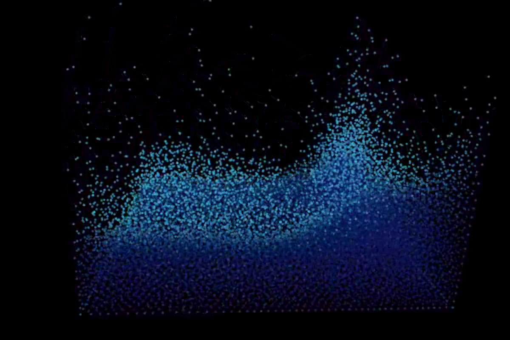

# Rainborg
Position-based Fluid Simulation.

### Dependencies

This project has a few dependencies, which CMake will try to find:

- [**OpenGL**](https://www.opengl.org/)
- [**GLFW**](http://www.glfw.org/)
- [**GLM**](http://glm.g-truc.net/0.9.6/index.html) - Included
- [**RapidXML**](http://rapidxml.sourceforge.net/) - Included
- [**TCLAP**](http://tclap.sourceforge.net/) - Included
- [**libPNG**](http://libpng.sourceforge.net/) - for image output
- Required for compilation on GPU:
    - [**CUDA**](http://www.nvidia.com/object/cuda_home_new.html)
    - [**Thrust**](https://thrust.github.io/)

### Compilation

Once the dependencies are installed, simply run CMake on the build directly, like so:

    > mkdir build
    > cd build
    > cmake ..

You can also configure CMake flags `GPU_ENABLED` and `USE_PNG` to enable CUDA compilation and PNG output respectively. For PNG output, make sure you have an empty directly `pngs` in your build directory.

    > ccmake ..
    # configure variables...

Once you've configured everything, run the generated Makefile:

    > make

This should generate the executable `./testflow`.

### Running our code

Type `./testflow -h` for a list of commands and their descriptions. Note that a scene file (such as the ones included in `/assets`) is required for the simulation to run.

### Structure
- Main:
    + Parse command line arguments
    + Windows and display loop
    + Initialize things??
        - Load Files
        - Create scenes + data structures
- Parser:
    + Scene Parser
        - XML nodes:
        - fluid block positions, rest densities, colors, velocity, mass
            * fluid constants - viscosity, etc
        - fluid boundaries
        - camera position, rotation
        - timestep, timeframe
    + Mesh Parser
        - obj file, ply (or whatever)
        - translate to mesh boundary object triangles
- Scene:
    + Boundaries -> Mesh objects
    + FluidSim
        - Fluid Particles
            - mass, rest density (shared)
            - Position
            - Velocity
            - Color
        - Bounding box
        - FluidSim.step(dt, scene)
    + Forces (gravity)

### Todo

- Rendering
    + Spheres (with lighting)
    + Optional import mesh, boundary
- Simulation
    + Do the thing
    + Go through FOSSSim, stepper
    + Boundary/collision detection handling (static rigid objects)
    + Serial
        * external forces (gravity)
        * predict position
        * find neighbors
        * jacobi iterator
            - constraint, lambda
            - s-correction
            - calculate delta-p
            - collision detection response
            - update positions
        * vorticity confinement
        * position update
    + Parallel
        * Buckets, arbitrary acceleration data structures
        * same thing...
    + Future

### References

The algorithms in this project follow the following papers:

[Miles Macklin, Matthias Muller, Position Based Fluids](http://mmacklin.com/pbf_sig_preprint.pdf)

Additionally, an C++ OpenGL framework by Daniel Chappuis is modified for use in this project: https://github.com/DanielChappuis/opengl-framework

Finally, some XML parsing and Math utility functions are taken from FOSSSim, the codebase from Computer Animation W4167.
